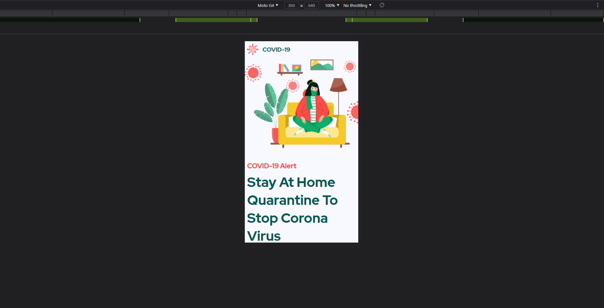

<h1> Documentataion: </h1>

<h2> <u>Index:</u> </h2>
  <li><b>1. <a href="#ack" style="text-decoration:none; color: green">Acknowledgement</a></b></li>
  <li><b>2. <a href="#intro" style="text-decoration:none; color: green">Introduction</a></b></li>
  <li><b>3. <a href="#tools" style="text-decoration:none; color: green">Software/Technologies used</a></b></li>
  <li><b>4. <a href="#flow" style="text-decoration:none; color: green">Basic Flow Diagram/Folder structure </a></b></li>
  <li><b>5. <a href="#ss" style="text-decoration:none; color: green">Screenshots </a></b></li>
  <li><b>6. <a href="#output" style="text-decoration:none; color: green">Output Video </a></b></li>
  <li><b>7. <a href="#ct" style="text-decoration:none; color: green">Compatiblity/Testing </a></b></li>
  <li><b>8. <a href="#dp" style="text-decoration:none; color: green">Deployment and Live link </a></b></li>
  <li><b>9. <a href="#lm" style="text-decoration:none; color: green">Limitations and Future enhancements </a></b></li>
  <li><b>10. <a href="#ch" style="text-decoration:none; color: green">Challenges</a></b></li>

  

  <h2 id="ack">Acknowledgement:</h2>

  

  
<i>I would like to give a huge thanks to the whole Blue Sky Analytics team for giving me  this opportunity and providing me with this great frontend task which not only refined my knowledge for frontend but also helped me explore new tecnologies. </i>

  

  <h2 id="intro">Introduction:</h2>

  
A brief introduction to my project.This a website which contains the information regarding the covid-19. The website contains the information related to overview detail of the covid-19, This website also shows how covid-19 is contagious with the help of cards. Also the website shows the information regarding the covid-19 symptoms with help of diagram. As per the requirement there is one section in the landing page which contains the information regarding the precautions. There is one covid map section basically a covid-19 heat map and also a live covid case section, currently these two things are not functional. There is also a feedback section/'contact us' section where people can send there email and through which we can communicate (currently not functional) and lastly the footer section which contains the different pages link and the social medial links.

  
  

  <h2 id="tools">Software/Technologies used:</h2>

  <i><u>The Software and technologies used are as follows: </u></i>

  <b><li>Gatsby</li></b>
  <b><li>Gatsby Plugins</li></b>
  <b><li>Css modules</li></b>
  <b><li>Vscode Editor</li></b>
  <b><li>Adobe Xd / Figma</li></b>
  <b><li>Google chrome devtools</li></b>
  <b><li>Git</li></b>
  <b><li>Netlify</li></b>

  

  <h2 id="flow">Basic Flow Diagram/Folder structure</h2>

  
  <h6>The site assets contains different images in svg format and also the information regarding site such as contagion, precautions, overview all in .md files. All images are in <i>src/images</i> folder and information regarding covid 19 are saved in two folders <i>sitebook1 and sitebook2</i> in src folder. </h6>
  

  
<h2 id="ss">Screenshots</h2>

<li><b>Console Output</b></li>

 
 
<li><b>Landing page on desktop</b></li>

 
 
<li><b>Error page Output</b></li>

 
 
<li><b>Landing Page on mobile screen</b></li>

 
 
<li><b>Landing Page on tablet screen</b></li>

<h2 id="output">Output Video</h2>

<b>Click on the above image to open the video</b>

<h2 id="ct">Compatiblity/Testing</h2>

<h4>This web app in whole was made with gatsby.</h4>

<h6>The environment/configuration in which this web app was made comprises of:</h6>

<li><b>16gb of ram</b></li>
<li><b>i-7 10750</b></li>
<li><b>Windows 10 (bulid no: 19043) </b></li>
<li><b>Nvme Intel ssd 1Tb</b></li>
<li><b>Google chrome version: 92.0.4515.159</b></li>

<h6>For testing this web app the above same configuration was used.</h6>
<h6>The screen size in which this web app was tested is 1920x1080 px and also with some popular mobile screen sizes too usinf chrome dev tools</h6>
 
<h5>Compatibility</h5>
<h6>The minimum requirement to run this web app is:</h6>
<li><b>For running in desktop:</b> Any web browser with latest version.  
<b>Recommended:</b><b>1920px screen size and google chrome as a browser.</b></li>
 
<li><b>For running in mobile:</b> Any mobile with recent android version with minimum 320px of screen size.
    
<li><b>For running in Tablet:</b> Any tablet with recent android version with maximum 800px of screen size. 

<h2 id="dp">Deployment and Live link</h2>

<h6>For deployment the web app is first pushed to Github and then its being deployed to netlify free hosting service</h6>

<h2 id="lm">Limitations and Future enhancements</h2>

<h6>The limitations of this web app are:</h6>

<li><b>The screen alignnment breaks with some of the screen size points</b></li>
<li><b>Only the landing page is active currently</b></li>
<li><b>Corona live report and covid-19 heat map is not active right now</b></li>
<li><b>Customer Support is not active</b></li>

<h6>The future enhancments of this web app are:</h6>
<li><b>Making the other links on the landing page active. </b></li>
<li><b>Providing with a corona live report and covid-19 heat map</b></li>
<li><b>Customer support activation which is present near the footer section.</b></li>

<h2 id="ch">Challenges</h2>

<i>As a whole this project was fun doing. Through out this assignment duration I came to know many technologies such as gatsby and learned abouts its plugins and also laearned to implement css modules. The challenge which I faced the most was to make the web app compatible with almost all screen sizes and making the web look exactly the same as the mockup one. Implementation of some the figma assets and making it fit inside the screen was also a challenge for me. The web is not 100% replica of the covid-19 figma mockup but I hope that I provied you with a decent output.</i>

